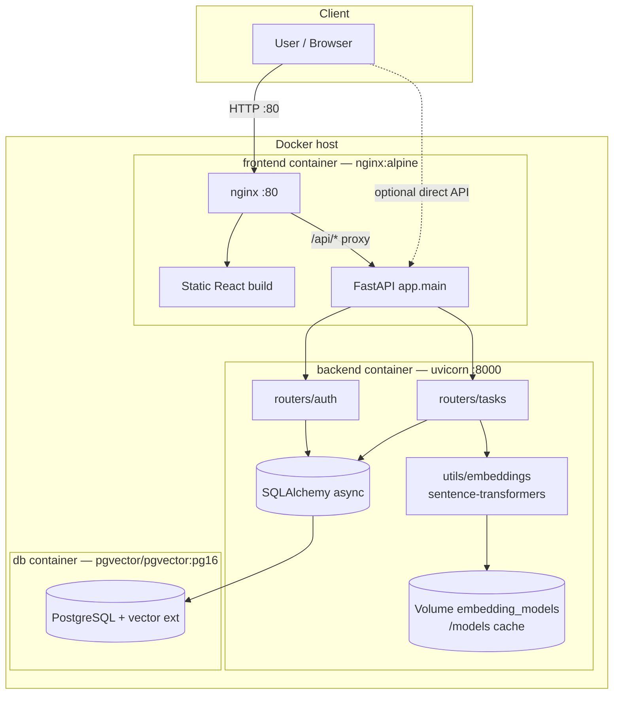
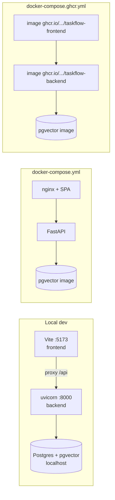
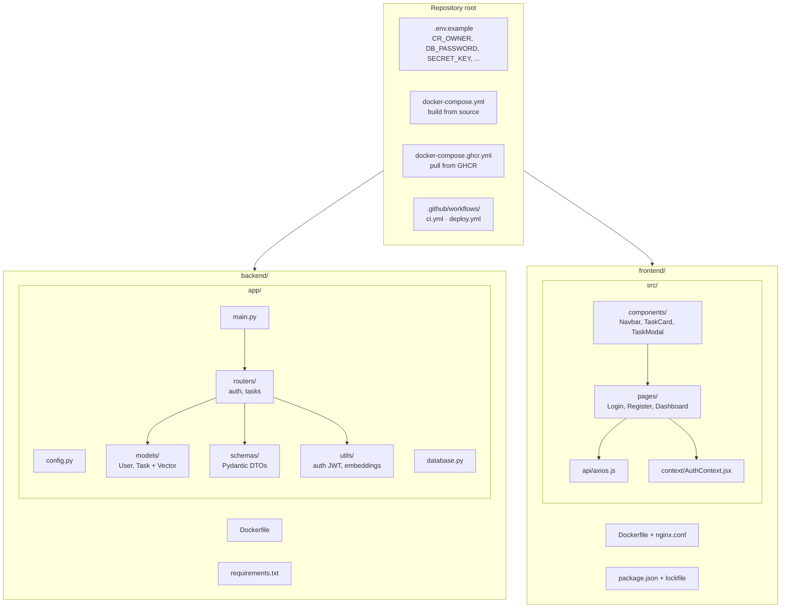
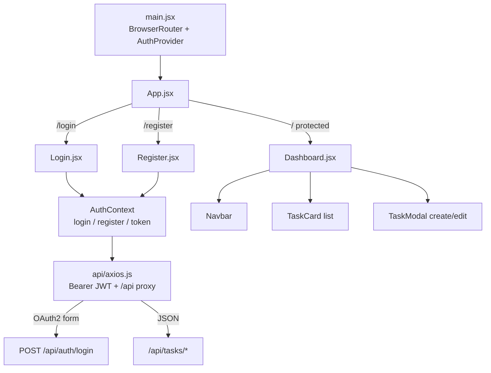
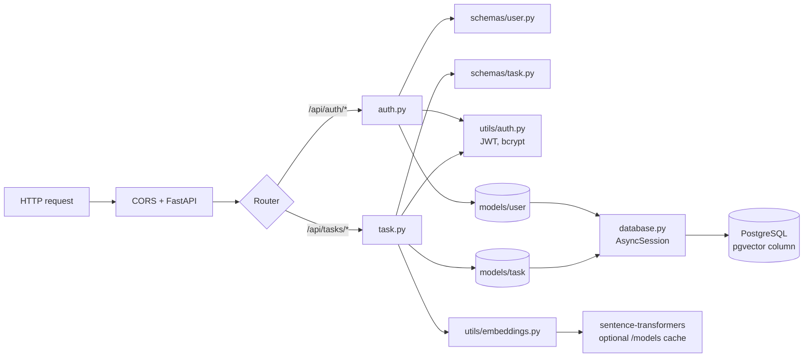
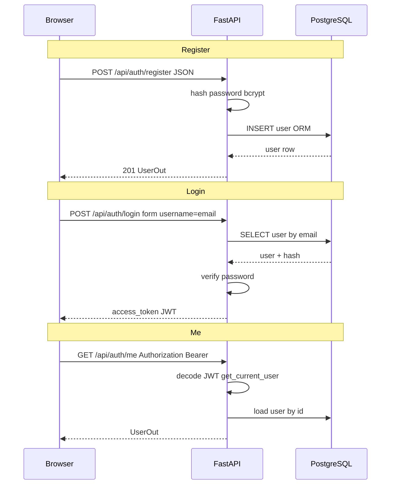
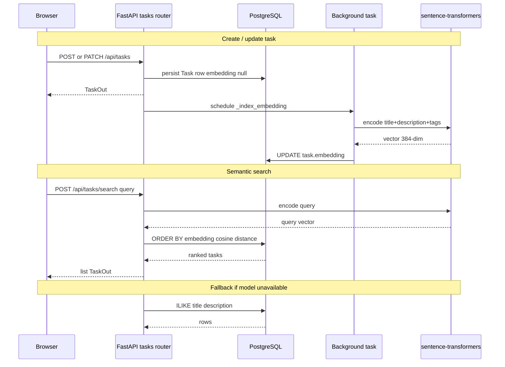
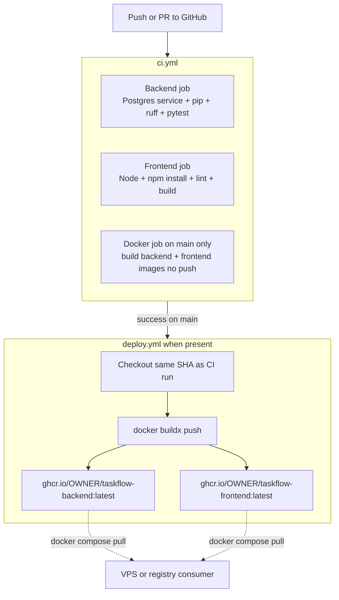

# TaskFlow

> Smart task management with AI-powered semantic search, built with FastAPI + React + pgvector.


## Features

- **JWT Authentication** — secure register / login flow
- **Full CRUD** — create, update, delete tasks with priority, status, tags, due dates
- **Semantic Search** — natural-language search powered by `sentence-transformers` + pgvector cosine similarity
- **Production-ready** — Dockerized, CI/CD via GitHub Actions, parameterized SQL queries, env-based secrets

## Tech Stack

| Layer | Technology |
|-------|-----------|
| Backend | FastAPI, SQLAlchemy (async), Alembic |
| Database | PostgreSQL + pgvector extension |
| AI Search | sentence-transformers (`all-MiniLM-L6-v2`) |
| Auth | JWT (python-jose), bcrypt |
| Frontend | React 18, Vite, TailwindCSS |
| DevOps | Docker, GitHub Actions |

## Architecture & flow diagrams

High-level views of how the repo fits together: runtime topology, code layout, request paths, and automation. GitHub renders these Mermaid diagrams in the README.

### 1. Runtime topology (Docker Compose — production-style)



### 2. Local development vs Docker (two ways to run)



### 3. Repository layout (how folders connect)



### 4. Frontend SPA routing and data flow



### 5. Backend request path (layers)



### 6. Authentication sequence (register / login / me)



### 7. Task lifecycle, embeddings, and semantic search



### 8. CI and optional CD (GitHub Actions)



---

## Project Structure

```
taskflow/
├── backend/
│   ├── app/
│   │   ├── config.py          # Settings from env vars (pydantic-settings)
│   │   ├── database.py        # Async SQLAlchemy engine
│   │   ├── main.py            # FastAPI app + lifespan
│   │   ├── models/            # SQLAlchemy ORM models
│   │   ├── schemas/           # Pydantic request/response schemas
│   │   ├── routers/           # auth + tasks endpoints
│   │   └── utils/             # JWT utils, embedding generator
│   ├── requirements.txt
│   └── Dockerfile
├── frontend/
│   ├── src/
│   │   ├── api/               # Axios instance with interceptors
│   │   ├── context/           # AuthContext (JWT management)
│   │   ├── pages/             # Login, Register, Dashboard
│   │   └── components/        # Navbar, TaskCard, TaskModal
│   └── Dockerfile
├── docker-compose.yml
├── docker-compose.ghcr.yml   # run pre-built images from GHCR (after Deploy workflow)
├── .github/workflows/ci.yml
├── .github/workflows/deploy.yml
└── .env.example
```

## Quick Start (Docker)

```bash
# 1. Clone the repo
git clone https://github.com/YOUR_USERNAME/taskflow.git
cd taskflow

# 2. Set up environment
cp .env.example .env
# Edit .env — fill in DB_PASSWORD and SECRET_KEY

# 3. Start everything
docker compose up --build

# App is now at http://localhost
# API docs at http://localhost:8000/api/docs
```

The backend image installs PyTorch + `sentence-transformers` at **build** time; model weights download on **first** semantic-search request and are cached in the `embedding_models` volume (`EMBEDDING_CACHE_DIR=/models`). That keeps CI Docker builds within GitHub runner disk limits.

## Local Development (without Docker)

### Backend

```bash
cd backend
python -m venv venv && source venv/bin/activate
pip install -r requirements.txt

# Create a .env in the backend/ folder (copy from root .env.example)
# Make sure PostgreSQL + pgvector is running locally

uvicorn app.main:app --reload --port 8000
```

### Frontend

```bash
cd frontend
npm install
npm run dev   # Starts at http://localhost:5173
```

## API Endpoints

| Method | Path | Description |
|--------|------|-------------|
| POST | `/api/auth/register` | Create account |
| POST | `/api/auth/login` | Login, returns JWT |
| GET | `/api/auth/me` | Current user info |
| GET | `/api/tasks/` | List tasks (filter by status/priority) |
| POST | `/api/tasks/` | Create task |
| PATCH | `/api/tasks/{id}` | Update task |
| DELETE | `/api/tasks/{id}` | Delete task |
| POST | `/api/tasks/search` | **Semantic search** |

Interactive docs: `http://localhost:8000/api/docs`

## Security Highlights

- Secrets loaded from environment variables (never hardcoded)
- Passwords hashed with bcrypt
- Parameterized SQL queries via SQLAlchemy ORM (no SQL injection)
- JWT expiry + ownership checks on every task operation
- CORS restricted to configured origins

## Continuous deployment (CD)

This repo includes **continuous deployment** in two layers:

### 1. Publish containers (GitHub Actions → GHCR)

Workflow [`.github/workflows/deploy.yml`](.github/workflows/deploy.yml) runs when:

- **`CI` succeeds on `main`** (via `workflow_run`), or  
- You trigger **Deploy** manually under **Actions → Deploy → Run workflow**.

It builds and pushes:

- `ghcr.io/<your-github-user>/taskflow-backend:latest` (+ SHA tag)
- `ghcr.io/<your-github-user>/taskflow-frontend:latest` (+ SHA tag)

**Make packages readable:** In GitHub → **Packages** → each package → **Package settings** → **Change visibility** (public for a portfolio, or private + `read:packages` PAT on the server).

**First-time setup:** Pushing workflow files needs a PAT with the **`workflow`** scope (or edit/commit the YAML on github.com).

### 2. Run what you published (VPS)

On any Linux host with Docker:

```bash
docker login ghcr.io -u YOUR_GITHUB_USERNAME -p YOUR_PAT_WITH_read:packages

cd taskflow
cp .env.example .env
# Set DB_PASSWORD, SECRET_KEY, ALLOWED_ORIGINS, CR_OWNER=<same username, lowercase>

docker compose -f docker-compose.ghcr.yml pull
docker compose -f docker-compose.ghcr.yml up -d
```

### 3. Managed platforms (alternative)

| Platform | Idea |
|----------|------|
| **Railway / Render / Fly** | Connect the GitHub repo; enable **auto-deploy on push to `main`** (platform builds from `backend/` + `frontend/` Dockerfiles). |
| **GHCR** | Point the service at the images from step 1 instead of rebuilding (fewer surprises vs huge ML deps on small builders). |

Render-style split (Postgres + API + static frontend) still works; ensure Postgres has the **`vector`** extension for semantic search.

## Deployment (Render — manual outline)

1. Push to GitHub  
2. Create a **Web Service** on [render.com](https://render.com) pointing to `backend/`  
3. Add environment variables from `.env.example`  
4. Create **PostgreSQL** with **`pgvector`** enabled  
5. **Static Site** for the frontend: build `npm run build`, publish `dist` (or deploy the frontend Docker image / GHCR image if you prefer one hostname + nginx proxy)

## Resume Bullet Points

**SWE Resume:**
> Built and deployed a full-stack task manager with JWT auth, async REST APIs (FastAPI), PostgreSQL, CI/CD via GitHub Actions, and Docker

**AI Resume:**
> Implemented natural-language semantic search using sentence-transformers + pgvector, with background embedding indexing and cosine similarity ranking
